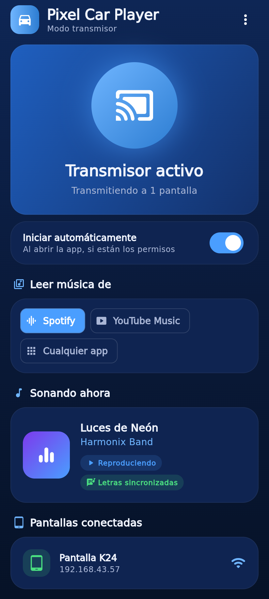

# Pixel Car Player

Pantalla de música para el carro + transmisor desde el celular. Un solo APK, dos modos.

La tableta del carro (head unit chino "máquina universal" K24) recibe el audio del celular por
Bluetooth A2DP, pero muestra muy poco: sin carátula, sin letras. **Pixel Car Player** resuelve eso:
el **celular** lee lo que suena en Spotify (título, artista, álbum, carátula, posición), busca la
letra sincronizada en [LRCLIB](https://lrclib.net) y lo **transmite** a la tableta por un canal de
datos aparte. La tableta solo muestra (estilo [Harmonix](https://github.com/SantiagortegaDev/harmonix)) y controla.

## Cómo funciona

```
 ┌──────────── Celular (modo "Transmisor") ─────────────┐        ┌──────── Tableta (modo "Pantalla") ───────┐
 │ Spotify ─► MediaSession                              │        │                                          │
 │   └─► TransmitterService (Kotlin, foreground)        │  TCP   │ LinkClient (Dart)                        │
 │        • lee título/artista/álbum/carátula/posición  │ ─────► │   • descubre por beacon UDP / gateway /   │
 │        • busca letras sincronizadas en LRCLIB        │  JSON  │     IP manual, o RFCOMM (BT)              │
 │        • servidor TCP :47321 + beacon UDP :47322     │ ◄───── │ CarController ─► CarPlayerScreen         │
 │        • servidor RFCOMM (BT clásico)                │  cmds  │   (pantalla completa estilo Harmonix:    │
 │        • ejecuta play/pause/next/prev/seek           │        │    portada, letras sync, wavy slider)    │
 │ Flutter UI: estado, permisos, autos conectados       │        │ Fallback: MediaSession local del radio   │
 └──────────────────────────────────────────────────────┘        └──────────────────────────────────────────┘
```

- El transmisor del celular es **nativo (Kotlin)** y corre como servicio en primer plano: sigue
  vivo con Spotify abierto y la pantalla apagada. La UI Flutter solo lo inicia/detiene y muestra su estado.
- Protocolo: una línea JSON por mensaje (ver [`docs/CONTRACT.md`](docs/CONTRACT.md)).
- El **audio** sigue yendo por Bluetooth como siempre; solo los **datos** usan Wi-Fi o Bluetooth RFCOMM.

## Capturas

| Tableta | Celular |
|---|---|
|  |  |

Selección de modo: `docs/screenshots/setup_tablet.png`, `docs/screenshots/setup_phone.png`.
Más capturas de la tableta: `docs/screenshots/car_*.png`; del celular: `docs/screenshots/phone_*.png`.

## Instalación

1. Descarga el APK más reciente desde **Releases** (pre-release "beta") o desde los artefactos de GitHub Actions.
2. Instala **el mismo APK** en el celular y en la tableta (permite "orígenes desconocidos").
3. Al primer arranque elige el modo:
   - **Celular**: "Transmisor (celular con Spotify)".
   - **Tableta**: "Pantalla del carro (tableta)".
4. Puedes cambiarlo luego desde el menú (⋮ → "Cambiar modo").

## Conexión

### Opción recomendada: Wi-Fi

1. Enciende el **hotspot** del celular y conecta la tableta a él (o conecten ambos a la misma red Wi-Fi).
2. En el celular abre la app, concede permisos y activa el transmisor.
3. Abre la app en la tableta: descubre al celular sola (beacon UDP, IP del gateway o IP manual).
   Si falla, escribe en la tableta la IP que el celular muestra en "Cómo conectar".
4. Mantén el audio Bluetooth emparejado como siempre.

### Opción alternativa: Bluetooth RFCOMM

Si el Android de la tableta expone el adaptador Bluetooth estándar: empareja celular y tableta,
y elige el celular en los ajustes de la tableta. No necesita Wi-Fi.

## Permisos (celular)

| Permiso | Para qué |
|---|---|
| Acceso a notificaciones | Obligatorio. Es lo que permite leer la sesión multimedia de Spotify. |
| Dispositivos cercanos (Bluetooth) | Servidor RFCOMM para el enlace sin Wi-Fi. |
| Notificaciones | Mostrar el aviso del servicio en primer plano. |

## Solución de problemas

- **La tableta no encuentra al celular**: verifica que estén en la misma red (o usa el hotspot del celular)
  y escribe la IP manualmente.
- **No aparece la canción**: Spotify debe estar **reproduciendo**; revisa que "Acceso a notificaciones" esté
  activo y que el origen elegido sea Spotify (o "Cualquier app").
- **El transmisor se detiene solo**: en el celular **desactiva la optimización de batería** para Pixel Car Player
  (Ajustes → Apps → Pixel Car Player → Batería → Sin restricciones).
- **Head unit "máquina universal" K24**: su módulo Bluetooth (XR829) es propietario y las apps de terceros
  no leen AVRCP de forma fiable. Si el Bluetooth de la tableta no sirve para el enlace de datos, **usa Wi-Fi**.
- Sin letras: no todas las canciones están en LRCLIB; la pantalla muestra "Sin letras".

## Compilar

```bash
flutter pub get
flutter analyze
flutter test
flutter build apk --release
```

Vista previa web (para capturas): `flutter build web --release` y abre `?mode=phone` o `?mode=car&demo=1`.

GitHub Actions (`.github/workflows/build-release.yml`) compila el APK en cada push a `main` y `claude/**`;
en `main` o con ejecución manual crea un pre-release. Firma opcional con los secretos
`ANDROID_KEYSTORE_BASE64`, `ANDROID_KEY_PASSWORD`, `ANDROID_STORE_PASSWORD`, `ANDROID_KEY_ALIAS`.

## Estructura

```
lib/
  main.dart            arranque y selección de modo
  core/                tema Harmonix, modelos, widgets compartidos
  data/bridge/         canal nativo tipado (pcp/native, pcp/events)
  data/link/           cliente del enlace (tableta)
  data/demo/           datos simulados
  car/                 UI de la tableta
  phone/               UI del celular (controlador + widgets)
  setup/               pantalla de selección de modo
android/               Kotlin: MediaSession, TransmitterService, RFCOMM
docs/                  PLAN.md, CONTRACT.md, screenshots/
```
